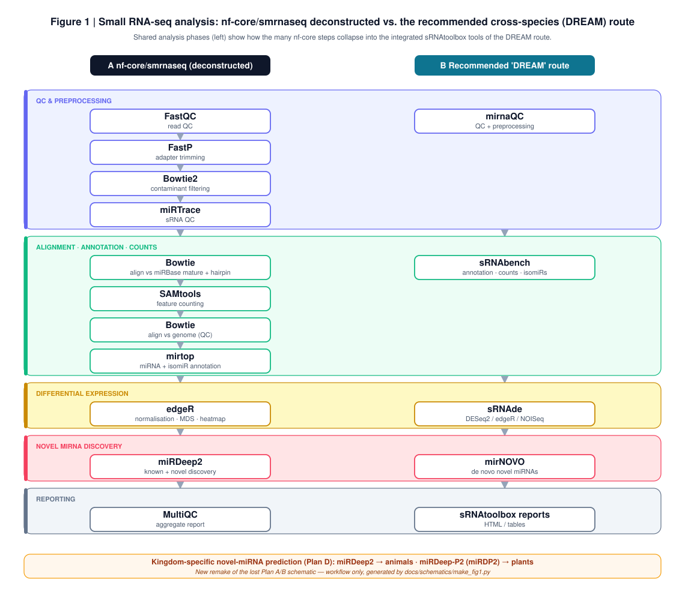

# Schematics

## Figure 1 (regenerated remake)



`fig1_pipeline_overview.svg` is a **new remake** of the lost Plan A/B schematic, built from
the documented pipeline steps by [`make_fig1.py`](make_fig1.py). It shows the nf-core/smrnaseq
pipeline (deconstructed) beside the recommended cross-species "DREAM" route, grouped by
shared analysis phase so the collapse of many nf-core steps into the integrated sRNAtoolbox
tools is visible. Workflow only — no results are depicted.

Regenerate / edit:

```bash
python make_fig1.py                 # -> fig1_pipeline_overview.svg
# export for the manuscript (needs librsvg or inkscape):
rsvg-convert -f png -o fig1.png fig1_pipeline_overview.svg
```

It is a schematic reconstruction, **not** the original figure — label it as such if a
reviewer needs the provenance.

## Original figures (lost)

The original Plan A / Plan B schematics and the deconstruction figure
(`smallRNAseq_analysis_pipeline_v1_NF_smRNAseq.png` / `.pdf`) lived in the
`smallRNAseq_mirDeep2_NFcore_DRB` repository, which was **deleted from GitHub** during
consolidation before the binaries were copied out; they are not on the working machine
either. If a copy surfaces (another machine, a backup, Zenodo, or the linked Google Doc),
drop it here. The pipeline logic they depicted is preserved textually in
[`../00_pipeline_decision.md`](../00_pipeline_decision.md) and
[`../../pipelines/nfcore_smrnaseq/README.md`](../../pipelines/nfcore_smrnaseq/README.md).
